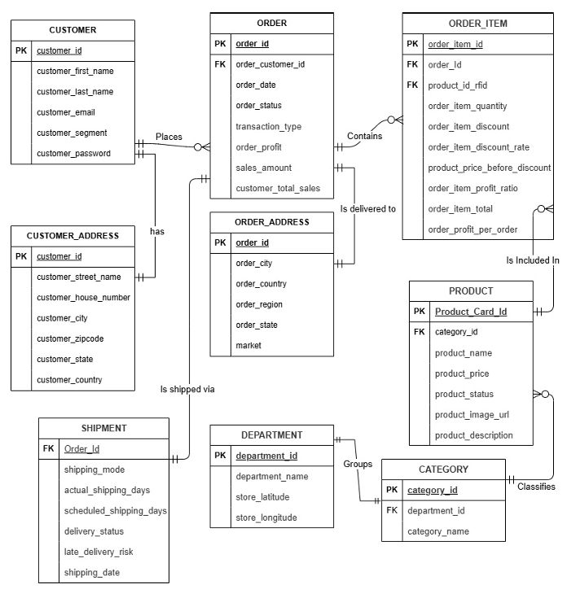
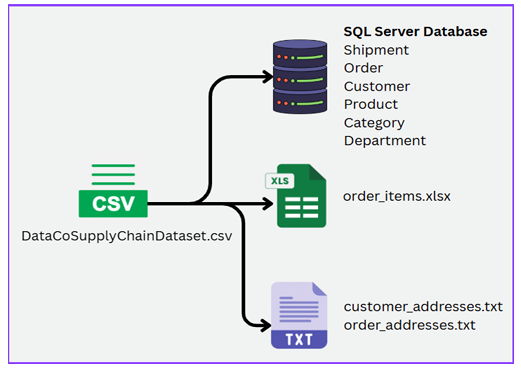
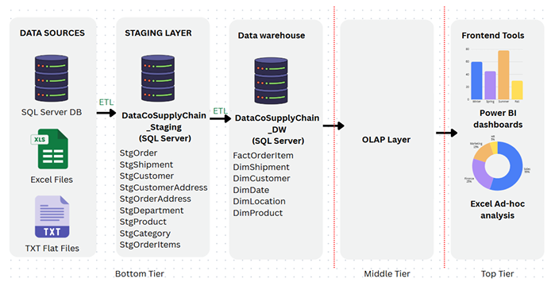
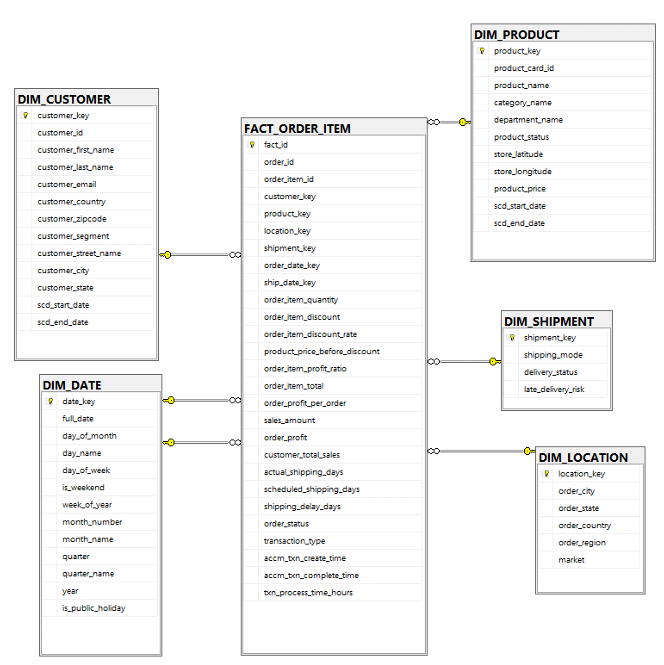

# DataCo Supply Chain Data Warehouse — ETL & Dimensional Modelling

> IT 3021 — Data Warehouse and Business Intelligence | Assignment 1
> SLIIT | Nethmina K.G.C.S (IT23403888)

A full source-to-target data warehouse build for the [DataCo Supply Chain dataset](https://data.mendeley.com/datasets/8gx2fvg2k6/5), covering multi-source data separation, dimensional modelling, and SSIS ETL pipelines including SCD Type 2 and an accumulating fact table.

## Overview

This project takes a single-source OLTP-style CSV and re-engineers it into a realistic multi-source environment (SQL Server, flat files, Excel), then builds a Star Schema data warehouse and loads it end-to-end using SQL Server Integration Services (SSIS).

**Grain:** one row per order line item.

### Source System


*Source OLTP ER diagram used as the basis for staging table and dimensional model design.*

## Architecture

```
Data Sources → Staging Layer → Data Warehouse → OLAP → BI Reporting
 (SQL Server,      (SSIS)         (Star Schema)
  TXT, Excel)
```


*The dataset was deliberately split into three source types — SQL Server, pipe-delimited TXT, and Excel — to demonstrate multi-source ETL.*


*Three-tier DW & BI architecture: staging → data warehouse → OLAP/BI consumption.*

| Layer | Technology |
|---|---|
| Source separation & data prep | Python |
| Staging & Data Warehouse | SQL Server |
| ETL orchestration | SSIS (SQL Server Integration Services) |
| Source types | SQL Server DB, pipe-delimited TXT flat files, Excel (.xlsx) |

## Data Warehouse Schema

**Fact table:** `FACT_ORDER_ITEM` — 180,519 rows, one row per order line item


*Star Schema — one central fact table surrounded by five dimensions.*

| Dimension | Rows | SCD | Notes |
|---|---|---|---|
| DIM_CUSTOMER | 20,652 | Type 2 | tracks segment & address history |
| DIM_PRODUCT | 118 | Type 2 | tracks price history |
| DIM_LOCATION | 3,716 | None | immutable delivery location |
| DIM_SHIPMENT | 12 | None | junk dimension (shipping_mode + delivery_status + late_delivery_risk) |
| DIM_DATE | 5,844 | None | static, pre-populated calendar dimension |

## Key Features

- **Multi-source extraction** — same base dataset deliberately split into a SQL Server database, pipe-delimited TXT files, and an Excel workbook to demonstrate multi-source ETL.
- **Data profiling** — a dedicated `Data_Profiling.dtsx` package surfaces data quality issues (nulls, redundant columns, mixed date formats) before any transformation logic is written.
- **Data quality fixes** — dropped 87%-null columns, translated Spanish country/region values via lookup, normalised three different `order_date` formats across 2015–2017 into a single clean DATE column.
- **SCD Type 2** on `DIM_CUSTOMER` and `DIM_PRODUCT` via the SSIS Slowly Changing Dimension Wizard, using `scd_start_date` / `scd_end_date`.
- **Junk dimension** (`DIM_SHIPMENT`) with a derived `late_delivery_risk` column, dropped from source after profiling confirmed 100% redundancy with `delivery_status`.
- **Accumulating fact table extension** — `FACT_ORDER_ITEM` extended with `accm_txn_create_time`, `accm_txn_complete_time`, and a computed `txn_process_time_hours` column, updated via a dedicated SSIS package using OLE DB Command + stored procedure (`UpdateFactAccmCompletion`).

## SSIS Packages

| Package | Purpose |
|---|---|
| `DataCoSupplyChain_Load_Staging.dtsx` | Source → Staging, all 3 source types |
| `DataCoSupplyChain_Load_DW.dtsx` | Staging → DW, dimensions loaded before fact, includes SCD handling |
| `DataCoSupplyChain_Update_AccmFact.dtsx` | Updates accumulating fact completion times |

## Validation

After executing the packages, row-count checks confirmed 180,519 fact rows loaded successfully across all dimensions, and a completion-time query confirmed `txn_process_time_hours` computed correctly for the accumulating fact.

For pipeline data-flow diagrams, data profiling results, and full validation screenshots, see the complete assignment report in `docs/`.

## Repository Structure

```
├── docs/
│   └── IT23403888_Assignment1.pdf     # Full assignment report (all pipeline diagrams & screenshots)
├── sql/
│   └── supply_chain.sql               # DW schema + stored procedures
├── ssis/                              # SSIS project files (.dtsx)
├── images/                            # Key diagrams referenced in this README
│   ├── er-diagram.png
│   ├── data-sources.png
│   ├── architecture-diagram.png
│   └── star-schema.png
└── README.md
```

> Export the 4 figures above from the assignment PDF and save them into `images/` using the exact filenames shown — the links in this README will resolve automatically once the files are in place. All other diagrams (ETL pipelines, data profiling, validation screenshots) are already in the full report under `docs/`.

## Author

**Nethmina K.G.C.S** (IT23403888)
Final-year Data Science undergraduate, SLIIT
[GitHub](https://github.com/chamodSN) · [Portfolio](https://chamodnethmina.netlify.app)
